# Shorten URL Service (Gin + Redis)

**Frontend**: https://ko330.github.io/shorten_url_frontend/

A concise URL shortener backend using Go + Gin and Redis. Deployed on Kubernetes (GCP VM) and exposed via Cloudflare Tunnel.

---


## Tech

- **Backend**: Golang (Gin), Redis
- **Frontend**:  HTML/JS/CSS, Github Pages
- **DevOps**: Docker, GitHub Actions, Kubernetes, GCP, Cloudflare Tunnel

---

## Architecture

```mermaid
graph TD
    %% --- Actors ---
    User((🌐 User))
    Dev((👨‍💻 Developer))

    %% --- 1. Runtime Flow ---
    subgraph Client_Side [Access Layer]
        User -->|1. Visit Web| GHP[GitHub Pages]
    end

    subgraph Server_Host [Cloud Environment]
        GHP -->|2. API Call| CFT[Cloudflare Tunnel]

        subgraph K3s_Cluster [K3s Cluster]
            CFT -->|3. Secure Entry| ING{Ingress Router}
            ING -->|4. Forward| GIN[Golang Gin API]
        end

        subgraph Docker_Engine [Standalone Docker]
            RED[Redis Cache]
        end

        GIN <-->|5. Cache Query| RED
    end

    %% --- 2. CI/CD Pipeline (Quality & Deployment) ---
    subgraph Automation [CI/CD Flow]
        Dev -->|A. Push Code| GHA[GitHub Actions]
        GHA -->|B. Run Unit Tests| TEST{Go Test}
        TEST -->|Pass| BUILD[Build & Push Image]
        BUILD --> GHCR[GitHub Container Registry]
    end

    %% Deployment updates
    GHCR -.->|C. Update Image| GIN

    %% Styling
    style User fill:#f9f,stroke:#333
    style Dev fill:#bbf,stroke:#333
    style TEST fill:#d4edda,stroke:#28a745,stroke-width:2px
    style GHP fill:#24292e,color:#fff
    style CFT fill:#f38020,color:#fff
    style GIN fill:#00add8,color:#fff
    style RED fill:#d82c20,color:#fff
    style GHCR fill:#444,color:#fff
```



---

## Deployment & notes

Deployed on GCP VM Kubernetes and exposed via Cloudflare Tunnel. CI uses GitHub Actions to build/push images and apply manifests; secrets are provided via GitHub Secrets.

## API
| Method | Endpoint | Description | Request Body | Response |
| :--- | :--- | :--- | :--- | :--- |
| `POST` | `/api/shorten` | Create short URL | `{"url": "https://..."}` | `{"short_url": "..."}` |
| `GET` | `/:id` | Redirect to long URL | - | `302 Redirect` |
| `GET` | `/health` | Health check | - | `{"status": "ok"}` |
## Run
```
export REDIS_ADDR=localhost:6379
export BASE_URL=http://localhost:8080
go run ./cmd/server
```
---

